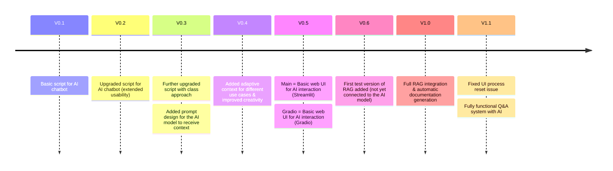

# **🤖 SimpleAI-Chatbot**  
### **An Intelligent Coding Companion**  

## **📌 Summary**  
SimpleAI-Chatbot is your **AI-powered assistant** designed to make your **developer life easier**! 🚀  
With its **adaptive context** and **powerful planning capabilities**, it helps you **organize projects**, **analyze repositories**, and **answer code-related questions**.  

---

## **🛠️ Roadmap**  



---

## **📦 Prerequisites**  
### **1️⃣ Clone the Repository**  
```bash
git clone https://github.com/tomdevtech/SimpleAI-Chatbot
cd SimpleAI-Chatbot
```

### **2️⃣ Install Ollama**  
🔗 [Download Ollama](https://ollama.com/download) and install it on your system.  

📌 **No need to manually download the model!** 🧠  
The code automatically downloads it when needed. 🚀  

### **3️⃣ Install Required Python Libraries**  
Run the following command to install all dependencies:  
```bash
pip install -r requirements.txt
```

Or install them manually:  
```bash
pip install streamlit requests langchain-core langchain-text-splitters \
langchain-chroma langchain-ollama ollama chromadb
```

### **4️⃣ Start the Chatbot 🚀**  
Run the following command to launch the **Streamlit UI**:  
```bash
streamlit run YourDirectory/src/main.py
```

### **5️⃣ Success! 🎉**  
✅ The chatbot is now up and running!  
🎯 Experiment with different models and explore all features.  

---

## **📚 References & Further Reading**  
- 📖 [Markdown Syntax Guide](https://docs.github.com/en/get-started/writing-on-github/working-with-advanced-formatting)
- 📖 [About READMEs – GitHub Docs](https://docs.github.com/en/repositories/managing-your-repositorys-settings-and-features/customizing-your-repository/about-readmes#about-readmes)  
- ⚙️ [CI/CD Pipelines – Overview](https://www.atlassian.com/continuous-delivery/ci-vs-ci-vs-cd)  
- 💡 [Ollama Documentation](https://ollama.com/docs)  
- 🧠 [LangChain Docs](https://python.langchain.com/)  

---

### **🔥 Ready to supercharge your coding experience? Let's go! 🚀**  
